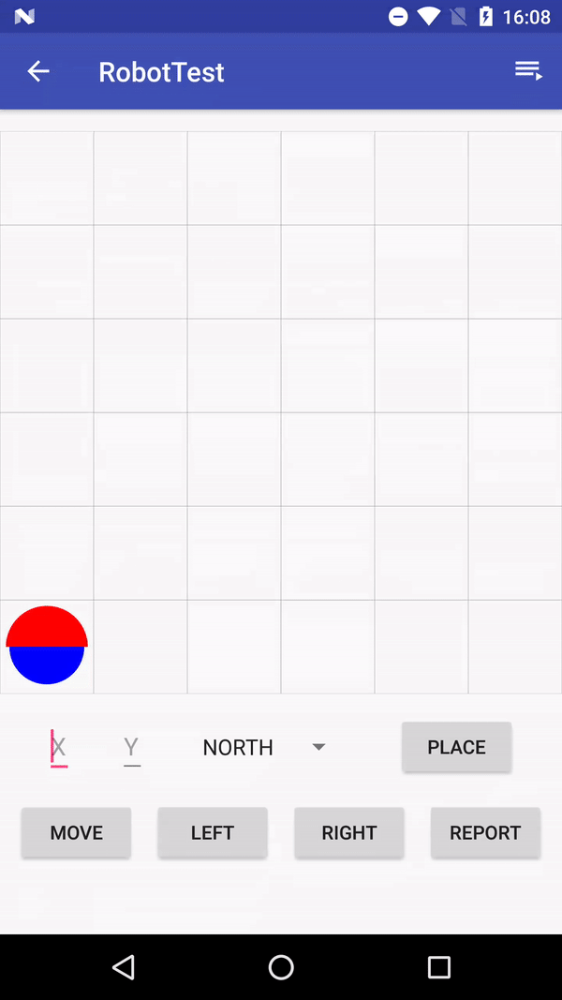
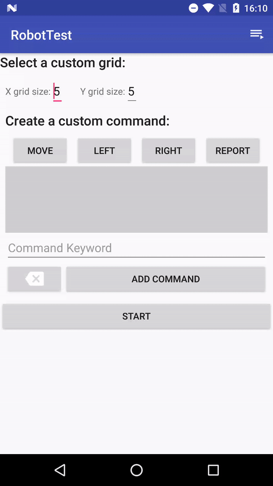

# Android Robot Test

This is an android version of the<a href="https://github.com/cumpstey/robot-test">Toy Robot Simulator</a> with a visual representation on a canvas and buttons for robot manipulation. The basic grid is 5x5 and the robot can be placed at a certain position facing the selected direction. From there the robot can be moved, turned left or right and return a report of the current position and direction.

It also supports customizable grid size and customized commands that are made from the basic commands (move, left, right and report). You can add more custom commands and edit them.

App has Unit Tests to assert the correct position after moving and turning the robot around.

